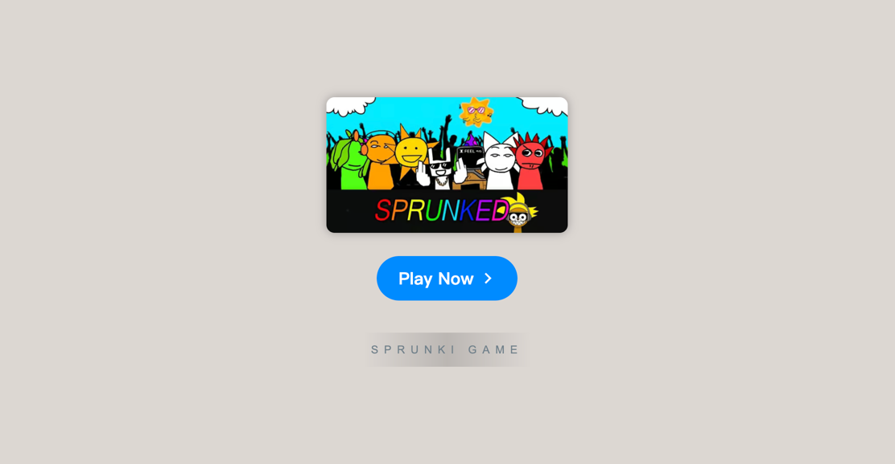

# Sprunki Retake Crossword

    

Welcome to **[Sprunki Retake Crossword](https://sprunkionline.com/retake-crossword/)**, an exciting twist on the popular Sprunki series. This game blends traditional crossword puzzles with the unique characters and eerie atmosphere of Sprunki. In this guide, we’ll explore how to play, the game features, and what makes it a standout experience for puzzle enthusiasts and fans of the Sprunki universe alike.

### Table of Contents
- Introduction
- Features
- How to Play
- Game Phases
- Popular Modes & Mods
- Tips for Success
- Resources

### Introduction

**Sprunki Retake Crossword** offers a fresh spin on the crossword puzzle genre, set against the backdrop of the spooky Sprunki world. As you solve puzzles, you'll encounter cryptic clues and unlock new characters, sounds, and phases that tie into the Sprunki universe. Whether you're a puzzle aficionado or just a fan of Sprunki, this game offers hours of entertainment.

### Features

| Feature                | Description                                                                          |
|------------------------|--------------------------------------------------------------------------------------|
| **Sprunki Crossword**   | Solve crossword puzzles with unique Sprunki clues and hidden elements.               |
| **Incredibox Integration** | Experience Sprunki characters integrated with the well-known Incredibox system. |
| **Spooky Modes**        | Unlock eerie and fun modes as you progress through the puzzles.                        |
| **Unique Soundtracks**  | Each puzzle phase features exclusive soundtracks that add to the atmosphere.         |
| **Online Play**         | No download necessary—access and play directly from your browser.                    |
| **Free Access**         | All game features and puzzles are completely free to enjoy.                          |
| **Community Sharing**   | Save your progress, share with friends, and receive feedback from the community.     |

### How to Play

To start playing **Sprunki Retake Crossword**, follow these simple steps:

1. **Open Browser**: Ensure you are using a modern browser like Chrome, Firefox, or Safari.
2. **Visit the Website**:
    - [Sprunki Retake](https://sprunkionline.com/retake)
3. **Solve Puzzles**: Begin solving crossword puzzles that feature unique Sprunki-themed clues.
4. **Unlock Phases & Sounds**: As you progress, new phases and creepy soundtracks are unlocked, enhancing your puzzle experience.

### Game Phases

**Sprunki Retake Crossword** is divided into multiple phases, each with a different set of puzzles and eerie features:

| Phase               | Description                                                                                   |
|---------------------|-----------------------------------------------------------------------------------------------|
| **Phase 1**          | Introduces basic puzzles with standard clues and mild atmospheric effects.                   |
| **Phase 2**          | Includes more complex puzzles with additional Sprunki characters and sounds.                  |
| **Phase 3**          | Unlocks advanced puzzles with a darker, more challenging theme, as well as exclusive rewards. |
| **Infected Mode**    | A spooky mode that adds creepy visuals and sound distortions as you solve puzzles.             |

### Popular Modes & Mods

**Sprunki Retake Crossword** offers a variety of exciting modes and mods, including:

- **Classic Mode**: The traditional crossword experience, perfect for puzzle purists.
- **Dark Mode**: A twisted version where the clues and the board shift as you play.
- **Infected Mode**: Adds a terrifying atmosphere with creepy background effects and soundtracks.

### Tips for Success

1. **Use Hints Wisely**: If you're stuck, hints are available, but use them sparingly to get the most out of your puzzle-solving experience.
2. **Focus on Sound**: Some clues are hidden within soundscapes—pay attention to the eerie audio cues for extra hints.
3. **Community Collaboration**: Join the Sprunki community to exchange tips, hints, and share your progress.

### Resources

For more information and resources related to **Sprunki Retake Crossword**, visit the following links:
- [Sprunki Retake Game](https://sprunkionline.com/retake)
- [Sprunki Phase](https://sprunkionline.com/category/sprunki-phase)

